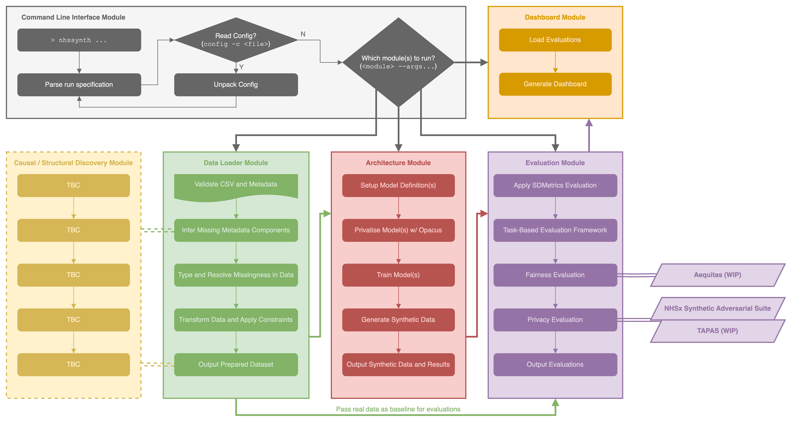

<!-- PROJECT SHIELDS -->
<div align="center">

<!--  -->


[](https://snyk.io/advisor/python/nhssynth)

</div>
<div align="center">

[](https://www.python.org/downloads/release/python-3113/)
[](https://pypi.org/project/nhssynth/)
[](https://pypi.org/project/nhssynth/)
[](https://pypi.org/project/nhssynth/)
[](https://github.com/nhsx/nhssynth/blob/main/LICENSE)
[](https://github.com/psf/black)
[](https://pycqa.github.io/isort/)

</div>

<!-- PROJECT LOGO -->
<div align="center">
  <a href="https://nhsx.github.io/NHSSynth">
    
  </a>
  <p align="center">
    <a href="https://nhsx.github.io/NHSSynth"><strong>Explore the docs »</strong></a>
    <br /><br />
  </p>
</div>

# NHS Synth

## About

This repository currently consists of a Python package alongside research and investigative materials covering the effectiveness of the package and synthetic data more generally when applied to NHS use cases. See the internal [project description](https://nhsx.github.io/nhsx-internship-projects/synthetic-data-exploration-vae/) for more information.

## Getting Started

### Project Structure

- The main package and codebase is found in [`src/nhssynth`](src/nhssynth/) (see [Usage](#usage) below for more information)
- Accompanying materials are available in the [`docs`](docs/) folder:
  - The components used to create the GitHub Pages [documentation site](https://nhsx.github.io/NHSSynth/)
  - A [report](docs/reports/report.pdf) summarising the previous iteration of this project
  - A [model card](docs/model_card.md) providing more information about the VAE with Differential Privacy
- Numerous exemplar configurations are found in [`config`](config/)
- Empty [`data`](data/) and [`experiments`](experiments/) folders are provided; these are the default locations for inputs and outputs when running the project using the provided [CLI](../src/nhssynth/cli/) module
- Pre-processing notebooks for specific datasets used to assess the approach and other non-core code can be found in [`auxiliary`](../auxiliary/)

### Installation

For general usage, we recommend installing the package via `pip install nhssynth` in a supported python version environment. You can then `import` the package's [modules](src/nhssynth/modules/) and use them in your projects, or interact with the package directly via the [CLI](src/nhssynth/cli/), which is accessed using the `nhssynth` command (see [Usage](#usage) for more information).

#### Secure Mode

Note that in order to train a generator in *secure mode* (see the [documentation](https://nhsx.github.io/NHSSynth/secure_mode/) for details) you will need to install the PyTorch extension package [`csprng`](https://github.com/pytorch/csprng) separately. Currently this package's dependencies are not compatible with recent versions of PyTorch (the author's plan on rectifying this - watch this space), so you will need to install it manually; for this we recommend following the instructions below:

```bash
git clone git@github.com:pytorch/csprng.git
cd csprng
git branch release "v0.2.2-rc1"
git checkout release
python setup.py install
```

#### Advanced Installation

If you intend on contributing or working with the codebase directly, or if you want to reproduce the results of this project, follow the steps below:

1. Clone the repo
2. Ensure one of the required versions of Python is installed
3. Install [`poetry`](https://python-poetry.org/docs/#installation) and either:
    - Skip to step four (and have `poetry` control the installation's virtual environment in their [proprietary way](https://python-poetry.org/docs/managing-environments/))
    - Change `poetry`'s configuration to manage your own virtual environments:
      
      ```bash
      poetry config virtualenvs.create false
      poetry config virtualenvs.in-project false
      ```

      You can now instantiate a virtual environment in the usual way (e.g. via `python -m venv nhssynth`) and activate it via `source nhssynth/bin/activate` before moving to the next step

4. Install the project dependencies with `poetry install` (optionally install `--with aux` to work with the [auxiliary notebooks](auxiliary/), `--with docs` to work with the [documentation](docs/), and/or `--with test` to be able to run the [testing suite](tests/))
5. You can then interact with the package in one of two ways:
    - Via the [CLI](src/nhssynth/cli/) module, which is accessed using the `nhssynth` command, e.g.
      
      ```bash
      poetry run nhssynth ...
      ```
      
      *Note that you can omit the `poetry run` part and just type `nhssynth` if you followed the optional steps above to manage and activate your own virtual environment, or if you have executed `poetry shell` beforehand.*
    
    - Through directly importing parts of the package to use in an existing project (`from nhssynth.modules... import ...`).

### Usage

#### CLI

This package comprises a set of modules that can be run using the `CLI` individually, as part of a pipeline, or via a configuration file. These options are available via the aforementioned `(poetry run) nhssynth` command:

```
nhssynth <module name> --<args>
nhssynth pipeline --<args>
nhssynth config -c <name> --<overrides>
```

To see the modules that are available and their corresponding arguments, run `nhssynth --help` and `nhssynth <module name> --help` respectively.

Configuration files can be used to run the pipeline or a chosen set of modules. They should be placed in the [`config`](config/) folder and their layout should match that of the examples provided. They can be run as in the latter case above by providing their filename (without the `.yaml` extension). You can also override any of the arguments provided in the configuration file by passing them as arguments in the command line.

To ensure reproducibility, you should always specify a `--seed` value and provide the `--save-config` flag to dump the exact configuration specified / inferred for the run (missing options will be populated in the outputted config, so it may be larger than one you would specify yourself). This configuration file can then be used in the future to reproduce the exact same run or shared with others to run the same configuration on their dataset, etc.

#### Python API

Alternatively, you may want to import parts of the package into your own project or notebook. There is a minimum working example of this [in the auxiliary folder](auxiliary/mwe.ipynb). You can learn more about the API and structure of the package and its modules in the docs to reuse components as you see fit.

### Package Structure

The figure below shows the structure and workflow of the package and its modules.



View a visualisation of the codebase [here](https://mango-dune-07a8b7110.1.azurestaticapps.net/?repo=nhsx%2Fnhssynth)!

### Roadmap

See the [open issues](https://github.com/nhsx/NHSSynth/issues) for a list of proposed features (and known bugs). Our [milestones](https://github.com/nhsx/NHSSynth/milestones) represent longer term goals for the project.

### Contributing

Contributions are welcome! We encourage you to first raise an issue with your proposed contribution to enable discussion with the maintainers. After that, please follow these steps:

1. Fork the project
2. Create your branch (`git checkout -b <yourusername>/<featurename>`)
3. Commit your changes (`git commit -m 'Add some amazing feature'`)
4. Push to the branch (`git push origin <yourusername>/<featurename>`)
5. Open a PR and we will try to get it merged!

_See [CONTRIBUTING.md](./CONTRIBUTING.md) for detailed guidance._

Thanks to everyone that has contributed so far!

<div align="center">
<a href="https://github.com/nhsx/nhssynth/graphs/contributors">
  
</a>
</div>

This codebase builds on previous NHSX Analytics Unit PhD internships contextualising and investigating the potential use of Variational Auto Encoders (VAEs) for synthetic data generation. These were undertaken by Dominic Danks and David Brind.

### License

Distributed under the MIT License. _See [LICENSE](./LICENSE) for more information._

### Contact

This project is under active development by [@HarrisonWilde](https://github.com/HarrisonWilde). For feature requests and bugs, please [raise an issue](https://github.com/nhsx/NHSSynth/issues/new/choose); for security concerns, please open a [draft security advisory](https://github.com/nhsx/NHSSynth/security/advisories/new). Alternatively, contact [NHS England TDAU](mailto:england.tdau@nhs.net).

To find out more about the [Analytics Unit](https://www.nhsx.nhs.uk/key-tools-and-info/nhsx-analytics-unit/) visit our [project website](https://nhsx.github.io/AnalyticsUnit/projects.html) or get in touch at [england.tdau@nhs.net](mailto:england.tdau@nhs.net).

<!-- ### Acknowledgements -->
